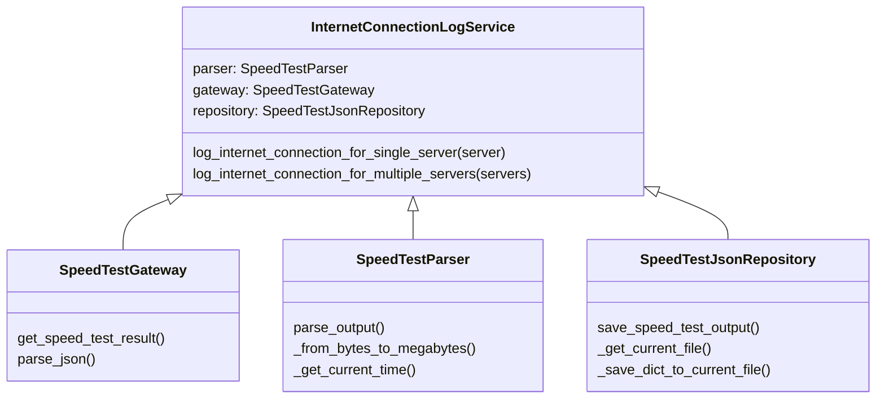

# internet-connection-registry
The main focus of this repository is to find a way of recording the internet bandwith available and the osiclation arround the suposed service provided.  
For this project I decided to use the [Ookla SpeedTest CLI](https://www.speedtest.net/es/apps/cli) and use as inspiration the [github repo of MiguelNdeCarvalho](https://github.dev/MiguelNdeCarvalho/speedtest-exporter/blob/main/src/exporter.py)

## How to run this project
You would need to install [docker & docker compose](https://docs.docker.com/engine/install/). After that you would be able to use the project with the Makefile

```bash
$ make build
$ make get-servers
```

1. Copy the ids and names of the servers you want to use. 
2. Create `Server` objects on the `the src/main.py` file
3. Give these servers to the `{fill_me}` function
4. Run the following command:
```bash
$ make run
```


### Troubleshooting 
If you have problems with the docker-compose & docker compose command you could try runing this:
```bash
$ ln -f -s /usr/libexec/docker/cli-plugins/docker-compose /usr/local/bin/docker-compose
```
If you are having problems with the armv7 maby you would need to install the following things on your machine:
```bash
$ sudo apt-get install -y qemu qemu-user-static
```
Remember that this is a project ment to be run in a raspberry pi, thats why I use that architecture


## Code base
